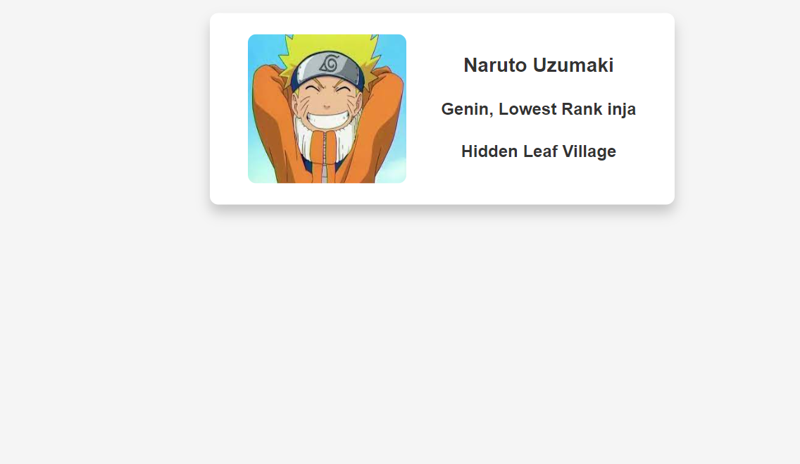

# Naruto Business Card Mini Project

 In this project, I've learned and applied various web development concepts to create a stylish business card for Naruto, the beloved anime character. This README will provide an overview of what I've learned and accomplished in this project.

## Table of Contents

- [Project Overview](#project-overview)
- [What I Learned](#what-i-learned)
- [Getting Started](#getting-started)
- [Technologies Used](#technologies-used)

## Project Overview

In this project, I created a visually appealing business card for Naruto, a well-known fictional character from the Naruto anime series.

## What I Learned 

- **Image Alt Texts:** I learned the importance of providing descriptive alt texts for images to enhance accessibility for users with disabilities.

- **Flexbox:** 

- **Flex Child Containers:** Understanding how to structure and style child elements within a flex container allowed me to achieve the desired layout and design.

- **Inheritance:** 

- **Shorthand Properties:** 

- **Web-Safe Fonts:**

## Technologies Used
- HTML
- CSS
- Web-safe fonts
- Flexbox layout

*Naruto Uzumaki - © Masashi Kishimoto*